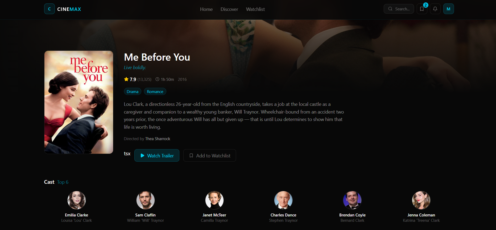
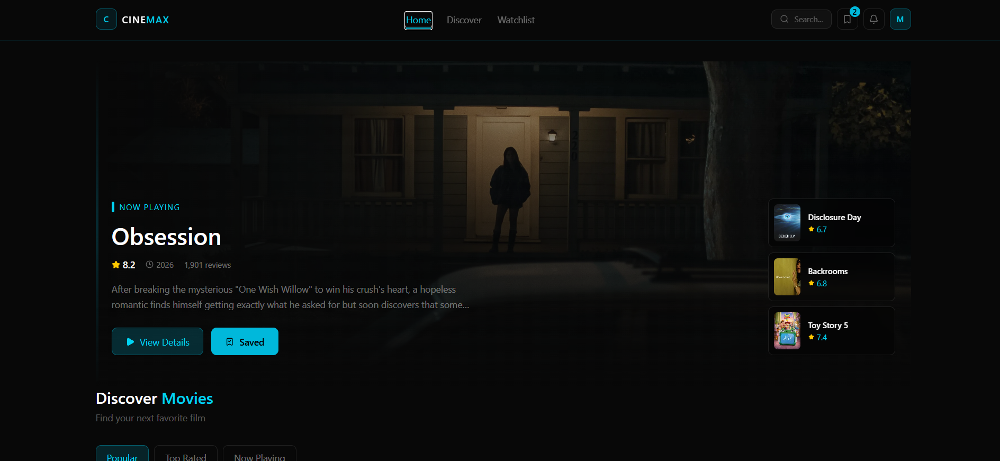
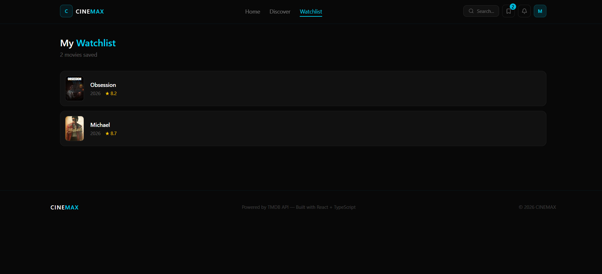

# 🎬 CINEMAX

A modern, animated movie discovery web app built with **React 19** and **TypeScript**. Browse popular, top-rated, and now-playing movies, filter by genre, search in real time, view rich movie details, and build a personal watchlist — all powered by [The Movie Database (TMDB)](https://www.themoviedb.org/) API.


## Preview
<div align="center">



</div>

---

## ✨ Features

- **Home feed** with Popular / Top Rated / Now Playing tabs, plus a genre filter
- **Animated hero section** showcasing the current top now-playing movie
- **Movie detail page** — overview, cast, director, trailer, and similar movies
- **Live search** with debounced input (no request spam while typing)
- **Personal watchlist** that persists across sessions using `localStorage`
- **Smooth page/UI transitions** powered by Framer Motion
- **Error boundary** and graceful loading/error states throughout
- Fully responsive, dark, neon-accented UI

## 🛠️ Tech Stack

| Category | Technology |
|---|---|
| Framework | React 19 + TypeScript |
| Build tool | Vite |
| Routing | React Router v7 |
| Data fetching & caching | TanStack Query (React Query) |
| HTTP client | Axios |
| Styling | Tailwind CSS v4 |
| Animation | Framer Motion |
| Icons | Lucide React |
| API | TMDB API v3 |

## 📚 What You Can Learn From This Project

- Fetching, caching, and revalidating remote data with **TanStack Query**
- Building reusable **custom hooks** (`useSearch` for debouncing, `useLocalStorage` for persistence)
- Managing shared state with the **React Context API** (the watchlist)
- Structuring a mid-size React app (pages, sections, UI components, services, types)
- Typing external API responses end-to-end with **TypeScript**
- Building declarative animations and page transitions with **Framer Motion**
- Configuring a **Vite dev proxy** to route API calls through a custom agent — useful when the API provider is inaccessible or restricted from your network/region

## 🚀 Getting Started

### 1. Clone the repo

```bash
git clone https://github.com/mobina-violet/CINEMAX.git
cd CINEMAX
npm install
```

### 2. Get a TMDB API key

This project needs a free API key from The Movie Database:

1. Go to [themoviedb.org](https://www.themoviedb.org/) and create an account (email verification is required before you can log in).
2. Once logged in, go to **Settings → API**.
3. Request/generate an API key (choose "Developer" use).
4. Copy the **API Key (v3 auth)** value.

### 3. Configure environment variables

Create a `.env` file in the project root (this file is git-ignored — never commit it):

```dotenv
VITE_TMDB_API_KEY=your_tmdb_api_key_here
VITE_TMDB_BASE_URL=https://api.themoviedb.org/3
VITE_TMDB_IMAGE_URL=https://image.tmdb.org/t/p
```

> ⚠️ **Never commit your `.env` file or push your API key to a public repo.** If a key is ever exposed, regenerate it immediately from *Settings → API → Regenerate Key* on TMDB.

### 4. (If TMDB is restricted in your country) configure a proxy

TMDB may be inaccessible from certain regions/networks. `vite.config.ts` is already set up to route `/api` requests through a local SOCKS5 proxy (e.g. v2ray, Clash, etc.) running on `127.0.0.1:10808`:

```ts
const agent = new SocksProxyAgent("socks5://127.0.0.1:10808");
```

If your proxy client uses a different local port, update this value to match it.

### 5. Run the app

```bash
npm run dev
```

Open [http://localhost:5173](http://localhost:5173) in your browser.

## 📁 Project Structure

```
src/
├── components/
│   ├── layout/       # Navbar, Footer
│   ├── sections/     # HeroSection, MovieGrid, GenreFilter
│   └── ui/           # MovieCard, Loader, Badge, ErrorBoundary
├── context/          # WatchlistContext (global watchlist state)
├── hooks/            # useSearch (debounce), useLocalStorage
├── pages/            # Home, Search, MovieDetail, Watchlist
├── services/         # api.ts — TMDB API client (Axios)
└── types/            # Shared TypeScript types
```

## 📄 License

This project uses the TMDB API but is not endorsed or certified by TMDB.
